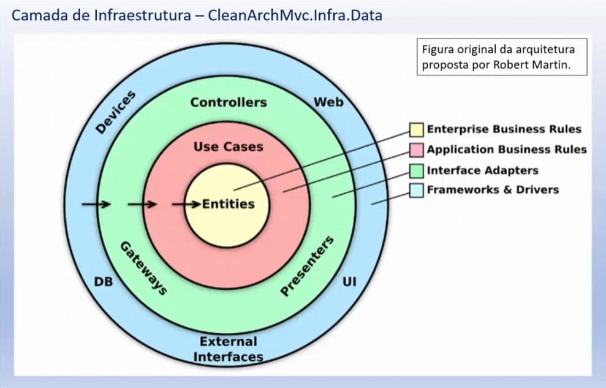

# CleanArchitectureEssencial
Clean Architecture Essencial - ASP .NET Core com C# - Migrado para .NET 8

## Descrição do projeto
Os principais aplicados com conceitos relacionados com a Clean Architecture e com as boas práticas que aplicadas, permitem criar aplicações ASP .NET Core com uma arquitetura limpa.
Os fundamentos apresentados baseiam-se na Clean Architecture, que refere-se à organização do projeto de forma que seja fácil de entender, e fácil de mudar conforme o projeto cresce.
A solução final possui os seguintes projetos: 
- Domain; 
- Application; 
- Infrastructure; 
- IoC; 
- Projeto de apresentação.

É uma aplicação ASP .NET Core MVC, onde vamos aplicar a separação das responsabilidades, a injeção de dependência, usar alguns conceitos do Domain Drive Design e implementar os padrões Repository e CQRS.
Esta aplicação ASP .NET Core MVC estará aderente às boas práticas e aos princípios da Clean Architecture de forma que a manutenção e também a inclusão de novas funcionalidades poderá ser feita de forma bem mais fácil e onde os testes poderão ser aplicados de forma simples.

## Apresentação do Projeto com WebUI

### Estrutura do Projeto

### Escopo geral do Projeto

### Camada Infraestrutura

### Conclusão do Projeto

## Apresentação do Projeto com WebUI/API

### Escopo geral do Projeto

